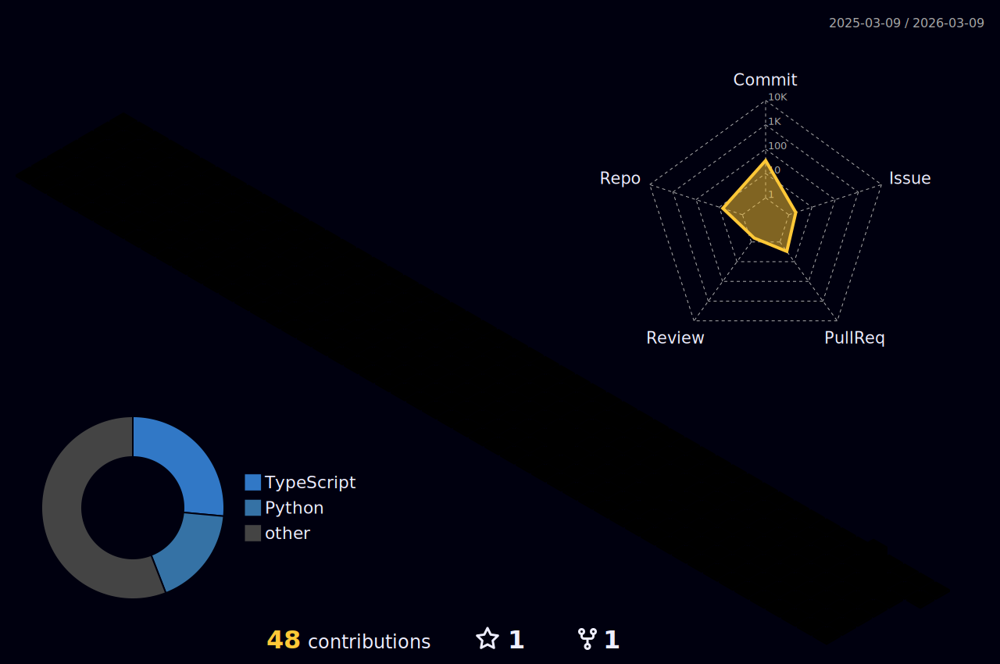

<div align="center">

<!-- ═══════════════════════════════════════════════════════════════ -->
<!--                    ANIMATED HEADER BANNER                       -->
<!-- ═══════════════════════════════════════════════════════════════ -->


<!-- ═══════════════════════════════════════════════════════════════ -->
<!--                      TYPING SVG                                 -->
<!-- ═══════════════════════════════════════════════════════════════ -->

[](https://git.io/typing-svg)

</div>

---

<!-- ═══════════════════════════════════════════════════════════════ -->
<!--                    OPERATOR PROFILE BLOCK                       -->
<!-- ═══════════════════════════════════════════════════════════════ -->

```yaml
┌──────────────────────────────────────────────────────────────────┐
│                    [ OPERATOR PROFILE ]                           │
├──────────────────────────────────────────────────────────────────┤
│  handle        :  SW1ZX  (Anousone Phyakeo)                       │
│  location      :  Vientiane, Laos 🇱🇦 · ASEAN                    │
│  role          :  Security Engineer @ LAILAOLAB ICT Solutions     │
│  web           :  https://www.taraxon.com                         │
│  linkedin      :  linkedin.com/in/anousonepk                      │
│                                                                    │
│  specialisms   :  Web/API/Mobile Pentest · AWS Security · GRC     │
│  frameworks    :  OWASP ASVS · OWASP MSTG · MITRE ATT&CK         │
│                   PTES · NIST CSF · ISO 27001 · STRIDE            │
│  certifications:  [eJPTv2, ICCA, CompTIA Pentest+, CC, Security+] │
│  ctf_platform  :  TryHackMe 🎯  (Swizzxxx)                       │
│                                                                    │
│  impact        :  150+ vulns found · 15 assessments · $150K+      │
│                   breach prevention · 85%+ remediation rate        │
│  status        :  ██████████████░░░░░  Always Hacking...          │
└──────────────────────────────────────────────────────────────────┘
```

---

<!-- ═══════════════════════════════════════════════════════════════ -->
<!--                         ARSENAL / BADGES                        -->
<!-- ═══════════════════════════════════════════════════════════════ -->

<div align="center">

## ⚔️ &nbsp;Arsenal

### 🔴 &nbsp;Application Security


### ☁️ &nbsp;Cloud & Infrastructure Security


### 💻 &nbsp;Programming & Automation


### 🏛️ &nbsp;Frameworks & Compliance


### 🎓 &nbsp;Certifications


### 🌐 &nbsp;Platforms


</div>

---

<!-- ═══════════════════════════════════════════════════════════════ -->
<!--                     GITHUB STATS CARDS                          -->
<!-- ═══════════════════════════════════════════════════════════════ -->

<div align="center">

## 📊 &nbsp;Battlefield Stats


&nbsp;&nbsp;


<br/><br/>


</div>

---

<!-- ═══════════════════════════════════════════════════════════════ -->
<!--                         TROPHIES                                -->
<!-- ═══════════════════════════════════════════════════════════════ -->

<div align="center">

## 🏆 &nbsp;Trophies


</div>

---

<!-- ═══════════════════════════════════════════════════════════════ -->
<!--                     SNAKE CONTRIBUTION GRAPH                    -->
<!-- ═══════════════════════════════════════════════════════════════ -->

<div align="center">

## 🐍 &nbsp;Snake Eating My Contributions

<picture>
  <source media="(prefers-color-scheme: dark)" srcset="https://github.com/anousonephyakeo/anousonephyakeo/blob/output/github-snake-dark.svg">
  
</picture>

</div>

---

<!-- ═══════════════════════════════════════════════════════════════ -->
<!--                   3D CONTRIBUTION CALENDAR                      -->
<!-- ═══════════════════════════════════════════════════════════════ -->

<div align="center">

## 🧊 &nbsp;3D Contribution Calendar



</div>

---

<!-- ═══════════════════════════════════════════════════════════════ -->
<!--                      METRICS DASHBOARD                          -->
<!-- ═══════════════════════════════════════════════════════════════ -->

<div align="center">

## 📡 &nbsp;Metrics Dashboard



</div>

---

<!-- ═══════════════════════════════════════════════════════════════ -->
<!--                      ACTIVITY GRAPH                             -->
<!-- ═══════════════════════════════════════════════════════════════ -->

<div align="center">

## 📈 &nbsp;Activity Graph

[](https://github.com/ashutosh00710/github-readme-activity-graph)

</div>

---

<!-- ═══════════════════════════════════════════════════════════════ -->
<!--                      TRYHACKME BADGE                            -->
<!-- ═══════════════════════════════════════════════════════════════ -->

<div align="center">

## 🎯 &nbsp;TryHackMe

[](https://tryhackme.com/p/Swizzxxx)

</div>

---

<!-- ═══════════════════════════════════════════════════════════════ -->
<!--                     FOOTER / VISITOR COUNT                      -->
<!-- ═══════════════════════════════════════════════════════════════ -->

<div align="center">


<br/>

*"The quieter you become, the more you are able to hear."*


</div>
